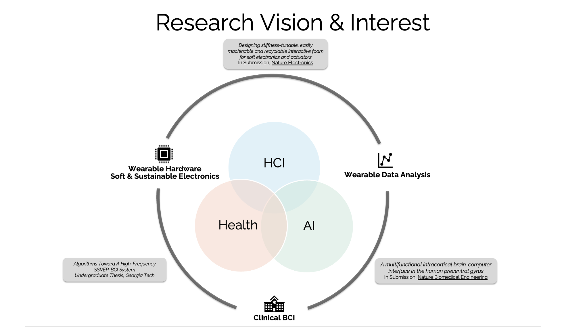

I am **Tri-lingual**!
[Japanese](about_jp) | [Chinese](about_cn)

&nbsp;
&nbsp;

Hi, this is ***Yunnuo (Noah) Zhang***.

I am currently a first year Master student at [Georgia Tech](https://www.gatech.edu) majoring in Computer Science, where I am advised by Dr. Chethan Pandarinath at [SNEL](https://www.snel.ai) and [BrainGate Emory](https://www.braingate.org). I am also working closely with [Dr. Tingyu Cheng](https://tingyucheng.com/about), a postdoc at [Ka Moamoa lab](https://kamoamoa.com/) led by Dr. Josiah Hester, and soon an assistant professor at Notre Dame, on the intersection of applied AI, novel, sustainable materials, and human-computer interactions.

I was honored to advised by [Dr. Thad Starner](https://www.cc.gatech.edu/home/thad/index.htm) and [Dr. Melody Jackson](https://faculty.cc.gatech.edu/~melody/) during my undergraduate, where I finished my thesis on wearable EEG-SSVEP sensors and pipeline. I also worked as a research assistant intern at [Michigan State University](https://www.msu.edu) with [Dr. Jinxing Li](https://www.labli.net), whom I was advised by with during my previous experience at Stanford University, Bao Group.

I am interested in **ML4 Health**, **Wearable Technology**, **HCI** and **Brain-computer Interface** researches. I am not only interested but enthusiastic in transforming clinical and medical into medical technologies to help reduce the load of medical providers and provide day-to-day healthcare to the public.

<figure>
  
  <figcaption>My research interests span across ML4Health, Wearable Technology, HCI, and clinical-BCI research, focusing on transforming healthcare through technology.</figcaption>
</figure>

<!-- I am **Tri-lingual**, feel free to check site in any of the language shown above. -->

&nbsp;
&nbsp;

